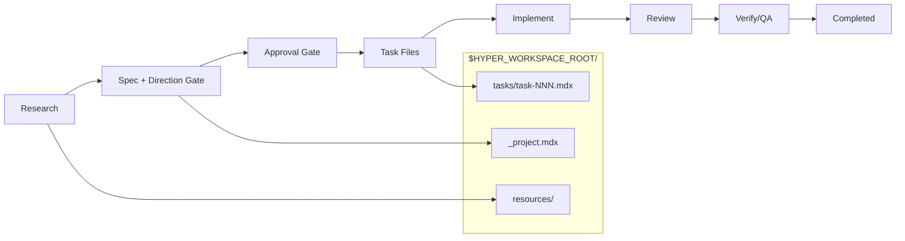

<p align="center">
  
  
  
</p>

# Hyper-Engineering

**Specs first. Code second. Verification always.**

A Claude Code plugin for local-first, spec-driven development. It turns workflows into reusable programs, keeps all artifacts local, and enforces human gates before code ships. Works standalone or with the Hypercraft desktop app.

## Why Hyper-Engineering?

Traditional AI-assisted development is chaotic. You prompt, get code, fix bugs, repeat. Context gets lost. Quality varies.

Hyper-Engineering inverts this:

- **Research before planning** - Parallel research agents explore the codebase and docs
- **Specs before code** - The spec is the source of truth
- **Approval before work** - Gates prevent wasted effort
- **Verification before done** - QA must pass before completion

## Quick Start

In Claude Code, run these slash commands:

```
# Add the marketplace
/plugin marketplace add juanbermudez/hyper-eng

# Install the plugin
/plugin install hyper

# Initialize workspace
/hyper:init

# Start planning
/hyper:plan "Add user authentication with OAuth"
```

## Workflow



## Commands

| Command | Description |
|---------|-------------|
| `/hyper:init` | Initialize workspace structure and migrate legacy data |
| `/hyper:plan` | Research → spec → approval → tasks |
| `/hyper:implement` | Execute a task with verification loops |
| `/hyper:implement-worktree` | Implement in an isolated worktree |
| `/hyper:review` | Parallel code review (security, architecture, performance, quality) |
| `/hyper:verify` | Automated + manual verification gates |
| `/hyper:status` | View project and task status |
| `/hyper:research` | Research-only workflow |
| `/hyper:import-external` | Import from external systems (Linear, GitHub, TODO.md) |

## Agent Hierarchy

A three-tier hierarchy for clear responsibility separation:

| Tier | Role | Model | Spawns | Never Does |
|------|------|-------|--------|------------|
| **Captain** | Routes requests | opus | Squad Leaders | Implement code, manage state |
| **Squad Leader** | Orchestrates domain | opus (persist) | Workers | Implement directly, spawn Squad Leaders |
| **Worker** | Executes tasks | sonnet/haiku | Nothing | Manage state, spawn agents |

```mermaid
graph TD
    U[User] --> C[Captain]
    C --> SL1[Plan Squad Leader]
    C --> SL2[Impl Squad Leader]
    C --> SL3[Review Squad Leader]
    SL1 --> W1[Research Workers]
    SL2 --> W2[Executor/Reviewer]
    SL3 --> W3[Domain Reviewers]
    W1 --> CLI[Hypercraft CLI]
    W2 --> CLI
    W3 --> CLI
    CLI --> FS[$HYPER_WORKSPACE_ROOT/]
    CLI --> DRV[Drive (personal:/ws:)]
```

## Status Model

Project flow:

```
planned → todo → in-progress → qa → completed
```

Task flow:

```
draft → todo → in-progress → qa → complete
```

## Archiving Projects

Archive hides projects from default views without deleting files:

```
hypercraft project archive --slug auth-system
hypercraft project archive --slug auth-system --unarchive
```

## Artifacts and Drives

Workspace artifacts live under `$HYPER_WORKSPACE_ROOT/` and are git-trackable.
Drive items live in HyperHome and are accessed via the CLI:

```
hypercraft drive list --json
hypercraft drive get ws:notes/overview.md --json
hypercraft drive get personal:ideas/agent-notes.md --json
```

## Components

| Type | Count | Description |
|------|-------|-------------|
| Agents | 15 | Captains, Squad Leaders, Workers, Research, Testing |
| Commands | 5 | Core workflow commands (thin wrappers) |
| Workflows | 5 | `.prose` programs in `commands/workflows/` |
| Skills | 4 | prose, hypercraft, hyper-agent-builder, hyper-activity-tracking |
| MCP Servers | 1 | Context7 for framework docs |

## OpenProse Integration

The workflow engine is powered by **OpenProse**, a programming language for AI sessions where the LLM becomes the virtual machine.

```
prose (VM) + hypercraft context = hypercraft (framework)
```

- `prose`: Universal OpenProse executor - runs ANY .prose program
- `hypercraft`: Our framework - loads prose + adds artifact rules, CLI, hierarchy

See [OpenProse](https://github.com/openprose/prose) for the language specification.

## Philosophy

**Specs matter more than code.**

Code is disposable. Specifications capture intent, decisions, and rationale. Hyper-Engineering treats specs as the source of truth, with the local `$HYPER_WORKSPACE_ROOT/` directory as the persistent system of record.

## Contributing

See [CONTRIBUTING.md](CONTRIBUTING.md) for guidelines.

## License

MIT — see [LICENSE](LICENSE) for details.

---

<p align="center">
  <sub>Built for developers who believe specs should outlive code.</sub>
</p>
