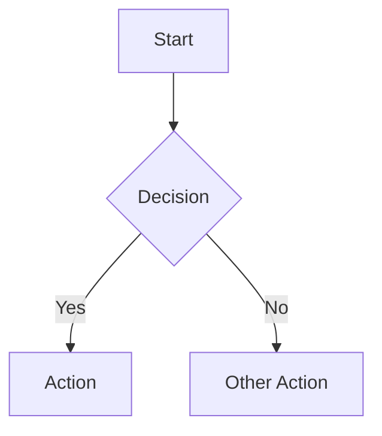
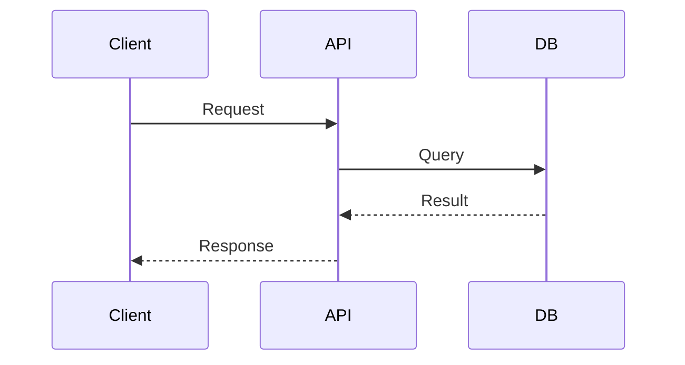
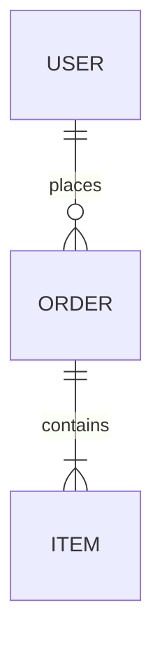
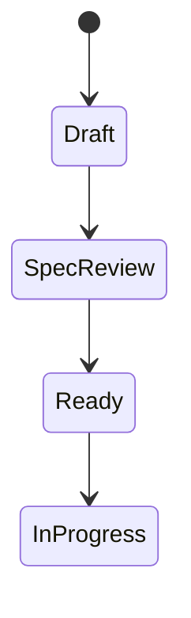

<skill name="linear-cli-expert">

<description>
Expert guidance for spec-driven development with Linear CLI and AI agents. Orchestrates research, planning, and implementation workflows using specialized sub-agents with Linear as the single source of truth.
</description>

<intake>
What would you like to do?

1. **Plan a new feature** - Research codebase, create spec, get approval, then break down into tasks
2. **Implement a task** - Execute a Linear task with verification loop
3. **Review code** - Run comprehensive review with domain sub-agents
4. **Verify implementation** - Run automated and manual verification checks
5. **Learn about the workflow** - Understand the hyper-engineering process

Please select an option or describe what you need.
</intake>

<routing>
| User Intent | Action |
|-------------|--------|
| Plan, new feature, spec, PRD | Invoke `/hyper-plan` command |
| Implement, work on, build, code | Invoke `/hyper-implement` command |
| Review, check, audit | Invoke `/hyper-review` command |
| Verify, test, check | Invoke `/hyper-verify` command |
| Learn, understand, help | Read [workflow-guide.md](./references/workflow-guide.md) |
</routing>

<context>
<linear_cli_reference>
The Linear Agent CLI is a Deno-based tool optimized for AI agents with JSON-first output.

**Full documentation:**
- [linear-cli-reference.md](./references/linear-cli-reference.md) - Complete command reference
- [ai-agent-patterns.md](./references/ai-agent-patterns.md) - Workflow examples and best practices

## Core Principles

1. **JSON is default output** - No flags needed, use `--human` for readable format
2. **Non-interactive** - Always provide all options to avoid prompts
3. **VCS-aware** - Auto-detects issues from git branch names
4. **Check success field** - Parse JSON and verify `result.success`

## Quick Reference

```bash
# Issue operations
linear issue create -t "Title" --team ENG --priority 2 -a self
linear issue view ENG-123
linear issue list --state "In Progress"
linear issue update ENG-123 --state "Done"
linear issue relate ENG-123 ENG-456 --blocks
linear issue comment create ENG-123 --body "Comment text"

# Project operations (with linked document)
linear project create -n "Name" -t ENG -c "$(cat spec.md)" --with-doc --doc-title "PRD"
linear project milestone create [uuid] --name "Phase 1" --target-date 2026-03-31
linear project update-create [slug] --body "Status update" --health onTrack

# Document operations
linear document create --title "Title" --project [id] --content "$(cat doc.md)"
linear document update [id] --content "$(cat updated.md)"

# Configuration
linear whoami                     # Show current user and config
linear workflow list              # List workflow states
```

## Important Notes

- Use `self` for self-assignment (not `@me`)
- Labels use repeated flags: `-l bug -l feature`
- Relationships use repeated flags: `--blocks ENG-1 --blocks ENG-2`
- Milestones require project UUID, not slug
- Content from files: `-d "$(cat file.md)"`
</linear_cli_reference>

<workflow_stages>
## Hyper-Engineering Workflow

### 1. Research Phase
- Agent asks clarifying questions (5-7 questions)
- Parallel sub-agents explore codebase
- Creates Linear draft project with research document
- Status: **Draft**

### 2. Planning Phase
- Agent reads research, asks scope questions
- Creates detailed spec with mermaid diagrams
- Includes ASCII layouts for frontend work
- Includes verification requirements
- Status: **Spec Review** (awaits human approval)

### 3. Task Breakdown (After Approval)
- Agent creates Linear issues from spec
- Sets up blocking relationships
- Each task includes verification sub-task
- Status: **Ready**

### 4. Implementation Phase
- Agent reads task spec from Linear
- Implements following codebase patterns
- Runs verification loop
- Status: **In Progress** → **Verification** → **Done**

### 5. Review Phase (Optional)
- Review orchestrator spawns domain sub-agents
- Security, architecture, performance, code quality
- Creates fix tasks for P1 issues
</workflow_stages>

<verification_requirements>
## Verification Checklist Template

### Automated Checks
- [ ] `pnpm lint` or equivalent passes
- [ ] `pnpm typecheck` or equivalent passes
- [ ] `pnpm test` or equivalent passes
- [ ] `pnpm build` or equivalent succeeds

### Manual Verification
- [ ] Feature works on localhost
- [ ] Edge cases handled correctly
- [ ] No console errors in browser
- [ ] Responsive on mobile viewport

### Visual Verification (UI changes)
- [ ] Matches spec/mockup
- [ ] Consistent with design system
- [ ] Accessibility checked

## On Verification Failure
1. Document the failure in Linear comment
2. Create fix sub-task
3. Implement fix
4. Re-run verification
5. Repeat until all checks pass
</verification_requirements>

<diagram_requirements>
## Required Diagrams in Specs

### Mermaid Diagrams (Required)
Use appropriate diagram type:

**Flowchart** - For process flows


**Sequence** - For API/service interactions


**Entity Relationship** - For data models


**State** - For state machines


### ASCII Layouts (Required for Frontend)
```
+------------------------------------------+
|  Header                        [Actions] |
+------------------------------------------+
|  Sidebar  |  Main Content               |
|           |  +------------------------+ |
|  - Nav 1  |  | Card Component         | |
|  - Nav 2  |  | - Title                | |
|  - Nav 3  |  | - Description          | |
|           |  | [Primary] [Secondary]  | |
|           |  +------------------------+ |
+------------------------------------------+
```
</diagram_requirements>
</context>

<examples>
<example name="planning_new_feature">
User: I want to add user authentication with OAuth

Agent:
1. Runs `/hyper-plan "Add user authentication with OAuth"`
2. Asks clarifying questions:
   - Which OAuth providers? (Google, GitHub, etc.)
   - Session storage approach? (JWT, cookies)
   - Protected routes scope?
3. Launches research sub-agents
4. Creates Linear project with PRD including:
   - Architecture diagram (mermaid sequence)
   - Login flow diagram (mermaid flowchart)
   - UI layout (ASCII)
5. Sets status to "Spec Review"
6. Waits for human approval
7. Creates tasks with dependencies after approval
</example>

<example name="implementing_task">
User: Implement ENG-123

Agent:
1. Runs `/hyper-implement ENG-123`
2. Reads task spec from Linear
3. Reads related documentation
4. Creates verification sub-task
5. Implements code following patterns
6. Runs verification:
   - `pnpm lint` ✓
   - `pnpm typecheck` ✓
   - `pnpm test` ✓
   - `pnpm build` ✓
7. Manual verification via Playwright
8. Updates Linear status to Done
</example>
</examples>

</skill>
