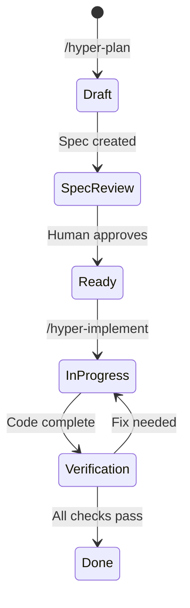

# Hyper-Engineering Workflow Guide

## Philosophy

**Specs matter more than code. Code is disposable; specifications are the source of truth.**

The hyper-engineering workflow treats Linear as the single source of truth for all development work. Every feature starts with research, moves through planning with human review gates, and ends with verified implementation.

## Workflow Overview



## Phase 1: Research (Draft)

**Goal**: Understand the problem space before proposing solutions.

### Process
1. **Clarifying Questions** - Agent asks 5-7 questions about:
   - Scope and constraints
   - Success criteria
   - Technical preferences
   - Timeline expectations
   - Stakeholders

2. **Parallel Research** - Sub-agents explore:
   - Codebase patterns and conventions
   - Similar implementations
   - External best practices
   - Documentation and APIs

3. **Research Document** - Created in Linear with:
   - Summary of findings
   - Current state analysis
   - Code references (file:line)
   - Recommendations

### Linear Status: **Draft**

## Phase 2: Planning (Spec Review)

**Goal**: Create a detailed, reviewable specification.

### Spec Requirements

Every spec MUST include:

1. **Problem Statement**
   - What problem are we solving?
   - Why does it matter?
   - What happens if we don't solve it?

2. **Proposed Solution**
   - High-level approach
   - Key technical decisions
   - Trade-offs considered

3. **Architecture Diagrams** (Required)
   ```mermaid
   flowchart TD
       A[User] --> B[Frontend]
       B --> C[API]
       C --> D[Database]
   ```

4. **UI Layouts** (Required for frontend)
   ```
   +----------------------------------+
   |  Header                          |
   +----------------------------------+
   |  Main Content                    |
   +----------------------------------+
   ```

5. **Success Criteria**
   - [ ] Measurable outcomes
   - [ ] Acceptance criteria
   - [ ] Performance requirements

6. **Verification Requirements**
   - Automated checks (lint, test, build)
   - Manual verification steps
   - Visual verification (if UI)

### Human Review Gate

The spec status is set to **Spec Review** and the agent WAITS for human feedback before creating tasks. This ensures:
- Human validates the approach
- Scope is agreed upon
- Resources are allocated
- Dependencies are identified

### Linear Status: **Spec Review**

## Phase 3: Task Breakdown (Ready)

**Goal**: Convert approved spec into actionable tasks.

### After Approval
1. Agent creates Linear issues from spec
2. Sets up blocking relationships (`--blocks`)
3. Each task includes:
   - Clear description
   - Acceptance criteria
   - Verification sub-task
4. Tasks linked to project and spec document

### Task Structure
```
Task: Implement [Feature]
├── Sub-task 1: [Component A]
├── Sub-task 2: [Component B]
├── Sub-task 3: [Integration]
└── Sub-task: Verify [Feature]  ← Always last
```

### Linear Status: **Ready**

## Phase 4: Implementation (In Progress)

**Goal**: Execute tasks with continuous verification.

### Process
1. Agent reads task spec from Linear
2. Reviews linked documentation
3. Implements following codebase patterns
4. Commits atomically with task references

### Best Practices
- Read existing code before writing
- Follow established patterns
- Write tests first (TDD)
- Commit often with clear messages
- Update Linear status as you work

### Linear Status: **In Progress**

## Phase 5: Verification (Verification)

**Goal**: Ensure implementation meets requirements.

### Automated Checks
```bash
pnpm lint        # Zero errors, zero warnings
pnpm typecheck   # Zero type errors
pnpm test        # All tests pass
pnpm build       # Build succeeds
```

### Manual Verification
- Feature works on localhost
- Edge cases handled
- No console errors
- Responsive design

### Visual Verification (UI)
- Matches spec/mockup
- Design system compliance
- Accessibility (keyboard, screen reader)

### Verification Loop
```
Implement → Verify → Pass? → Done
                 ↓
              Fail → Fix → Verify (repeat)
```

### Linear Status: **Verification** → **Done**

## Review (Optional)

For significant changes, run comprehensive review:

```bash
/hyper-review
```

Spawns domain sub-agents:
- **Security Reviewer** - OWASP, auth, input validation
- **Architecture Reviewer** - SOLID, patterns, boundaries
- **Performance Reviewer** - Complexity, queries, caching
- **Code Quality Reviewer** - Clarity, naming, tests

Findings are prioritized:
- **P1** - Must fix before merge
- **P2** - Should fix, can defer
- **P3** - Nice to have

## Commands Reference

| Command | Purpose |
|---------|---------|
| `/hyper-plan [description]` | Start planning workflow |
| `/hyper-implement [task-id]` | Implement a task |
| `/hyper-review` | Run comprehensive review |
| `/hyper-verify` | Run verification checks |
| `/hyper-init-stack` | Initialize stack template |

## Tips for Success

1. **Always start with /hyper-plan** - Even for "small" features
2. **Wait for spec approval** - Don't skip the review gate
3. **Verify early and often** - Run checks throughout implementation
4. **Update Linear status** - Keep the source of truth current
5. **Include diagrams** - Visual specs reduce ambiguity
6. **Write verification requirements** - Be specific about what "done" means
