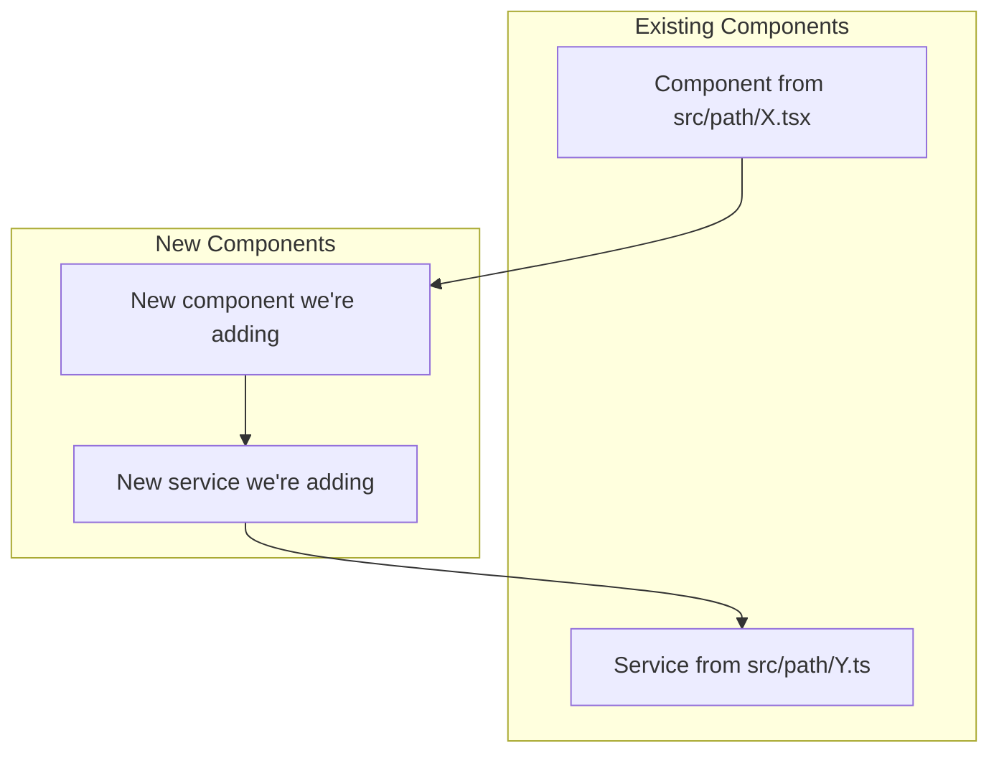
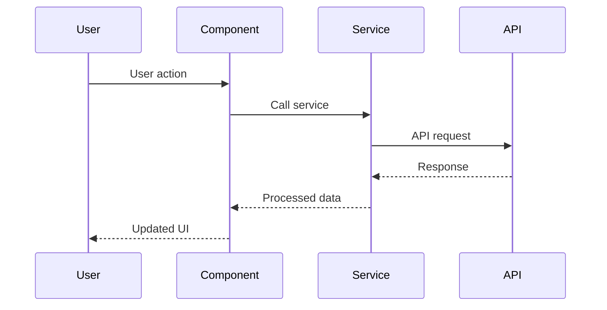

# [TITLE] - Technical Specification

## Executive Summary

**What**: [One sentence describing what we're building]
**Why**: [One sentence on the business/user value]
**How**: [One sentence on the technical approach]

## Problem Statement

### Current State
- What exists today and how it works
- Specific pain points with file:line references
- Example: "Current flow in `src/path/file.ts:45-67` requires manual handling"

### Desired State
- What the system should do after implementation
- Measurable improvements

### Impact if Not Addressed
- Consequences of maintaining status quo
- User/business impact

## Proposed Solution

### High-Level Approach
[2-3 paragraphs describing the solution strategy]

### Key Technical Decisions

| Decision | Choice | Rationale | Alternatives Considered |
|----------|--------|-----------|------------------------|
| [e.g., State management] | [e.g., Zustand] | [Why this choice] | [What else was considered] |

### Why This Approach
- Rationale for major architectural decisions
- Trade-offs acknowledged
- References to research findings

## Out of Scope (What We're NOT Doing)

| Item | Reason | Future Consideration |
|------|--------|---------------------|
| [Feature X] | [Why excluded] | [v2, never, TBD] |

## Architecture

### System Context



### Data Flow



## Detailed Changes

### File-by-File Breakdown

#### 1. `src/path/ExistingFile.ts` (MODIFY)

**Current** (lines X-Y):
```typescript
// Current implementation
```

**After**:
```typescript
// New implementation
```

**Why**: [Rationale for change]

#### 2. `src/path/NewFile.ts` (CREATE)

```typescript
// Full implementation template
```

**Pattern Reference**: Follow existing pattern in `src/path/Similar.ts`

## Implementation Phases

### Phase 1: [Foundation]

**Goal**: [Specific deliverable]

**Files**:
| File | Action | Description |
|------|--------|-------------|
| `src/types/new.ts` | CREATE | Type definitions |

**Dependencies**: None
**Verification**: `npm run typecheck` passes

### Phase 2: [Business Logic]

**Goal**: [Specific deliverable]

**Files**:
| File | Action | Description |
|------|--------|-------------|
| `src/components/Feature.tsx` | CREATE | Main component |

**Dependencies**: Phase 1
**Verification**: Component renders without errors

### Phase 3: [Integration & Testing]

**Goal**: [Specific deliverable]

**Files**:
| File | Action | Description |
|------|--------|-------------|
| `tests/Feature.test.ts` | CREATE | Unit tests |

**Dependencies**: Phase 1, Phase 2
**Verification**: All tests pass

## Success Criteria

### Functional Requirements
- [ ] User can [specific action]
- [ ] System [specific behavior] when [condition]

### Non-Functional Requirements
- [ ] Page load time < [X]ms
- [ ] No console errors
- [ ] Accessibility compliant

### Definition of Done
- [ ] All acceptance criteria met
- [ ] Code reviewed and approved
- [ ] Tests written and passing
- [ ] Documentation updated

## Verification Requirements

### Automated Checks
| Check | Command | Required |
|-------|---------|----------|
| Lint | `npm run lint` | Yes |
| Typecheck | `npm run typecheck` | Yes |
| Tests | `npm test` | Yes |
| Build | `npm run build` | Yes |

### Manual Verification Scenarios
| Scenario | Steps | Expected Result |
|----------|-------|-----------------|
| Happy path | 1. Navigate to X, 2. Click Y | Result appears |
| Error case | 1. Submit empty form | Error message shown |

## Technical Notes

### Performance Considerations
- [Specific optimizations needed]

### Security Implications
- [Input validation requirements]

### Accessibility Requirements
- [ARIA labels, keyboard navigation]

## Reference Documents

| Document | Location | Key Sections |
|----------|----------|--------------|
| Codebase Analysis | `resources/codebase-analysis.md` | Patterns |
| Best Practices | `resources/best-practices.md` | Recommendations |

## Open Questions (Must Resolve Before Approval)

| # | Question | Status | Resolution |
|---|----------|--------|------------|
| 1 | [Question] | Pending | [Answer] |
